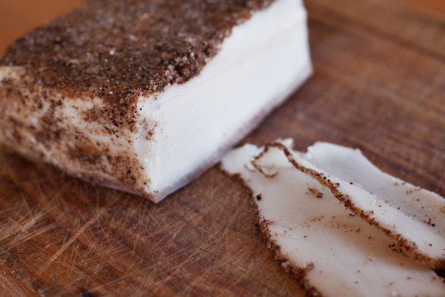

---
tags: [Food, salumi, charcuterie]
...
#Making Whipped Lardo
Lardo is an Italian salumi consisting of pork fat back that has been cured and dried. This is my first attempt at lardo and I've changed the concept a bit to make it simpler. Instead of slabs of beautiful white pork fat back I'm going to use a quicker cure and grind the fat, whipping it afterward to create more of a lardo spread to put on bread or to use for cooking.

